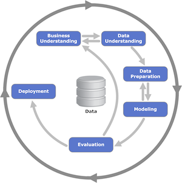

# MLOps - When Machine Learning meets DevOps

## Introduction

Data Scientists and ML developers need more than a Jupyter notebook to create a ML model, test it, put into production and integrate it with a portal and/or a basic web/mobile application in a reliable and flexible way.

----

There are two basic questions that you should consider when you start developing a ML model for a real Business Case:

1) How long would it take your organization to deploy a change that involves a single line of code?

2) Can you do this on a repeatable, reliable basis?

So, if you're not happy with the answers, MLOps is a concept that can help you: a) to create or improve the organization culture for CI/CD; b) to create an automated infrastructure that will support your processes.

[Amazon Sagemaker](https://aws.amazon.com/sagemaker/), a service that supports the whole pipeline of a ML Model development, is the heart of this solution. Around it, you can add several different services as the AWS Code* for creating an automated pipeline, building your docker images, train/test/deploy/integrate your models, etc.

Here you can find more information about [DevOps](https://aws.amazon.com/devops/) at AWS ([What is DevOps](https://aws.amazon.com/pt/devops/what-is-devops/)).

## Pre-Requisites

### Services

You should have some basic experience with:
  - Train/test a ML model
  - Python (scikit-learn)
  - Jupyter Notebook
  - [AWS CodePipeline](https://aws.amazon.com/codepipeline/)
  - [AWS CodeCommit](https://aws.amazon.com/codecommit/)
  - [AWS CodeBuild](https://aws.amazon.com/codebuild/)
  - [Amazon ECR](https://aws.amazon.com/ecr/)
  - [Amazon SageMaker](https://aws.amazon.com/sagemaker/)
  - [AWS CloudFormation](https://aws.amazon.com/cloudformation/)

Some experience working with the AWS console is helpful as well.

### AWS Account

In order to complete this workshop you'll need an AWS Account with access to the services above. There are resources required by this workshop that are eligible for the AWS free tier if your account is less than 12 months old. See the [AWS Free Tier](https://aws.amazon.com/free/) page for more details.

## Scenario

In this workshop you'll implement and experiment a basic MLOps process, supported by an automated infrastructure for training/testing/deploying/integrating ML Models. It is comprised into four parts:

1. You'll start with a **WarmUp**, for reviewing the basic features of Amazon Sagemaker;
2. Then you will create a **basic Docker Image** for supporting any scikit-learn model;
3. Then you will create a **dispatcher Docker Image** that supports two different algorithms;
4. Finally you will train the models, deploy them into a **DEV** environment, approve and deploy them into a **PRD** environment with **High Availability** and **Elasticity**;

Parts 2, 3 and 4 are supported by automated pipelines that reads the assets produced by the ML devoloper and execute/control the whole process.

### Crisp DM

It is important to mention that the process above was based on an Industry process for Data Mining and Machine Learning called [CRISP-DM](https://en.wikipedia.org/wiki/Cross_Industry_Standard_Process_for_Data_Mining).

CRISP-DM stands for “Cross Industry Standard Process – Data Mining” and is an excellent skeleton to build a data science project around.

----

There are 6 phases to CRISP:
   - **Business understanding**: Don’t dive into the data immediately! First take some time to understand: Business objectives, Surrounding context, ML problem category.
   - **Data understanding**: Exploring the data gives us insights about tha paths we should follow.
   - **Data preparation**: Data cleaning, normalization, feature selection, feature engineering, etc.
   - **Modeling**: Select the algorithms, train your model, optimize it as necessary.
   - **Evaluation**: Test your model with different samples, with real data if possible and decide if the model will fit the requirements of your business case.
   - **Deployment**: Deploy into production, integrate it, do A/B tests, integration tests, etc.

Notice the arrows in the diagram though. CRISP frames data science as a cyclical endeavor - more insights leads to better business understanding, which kicks off the process again.

## Instructions

First, you need to execute a CloudFormation script to create all the components required for the exercises.

1. Select the below to launch CloudFormation stack.

Region| Launch
------|-----
US East (N. Virginia) | 

